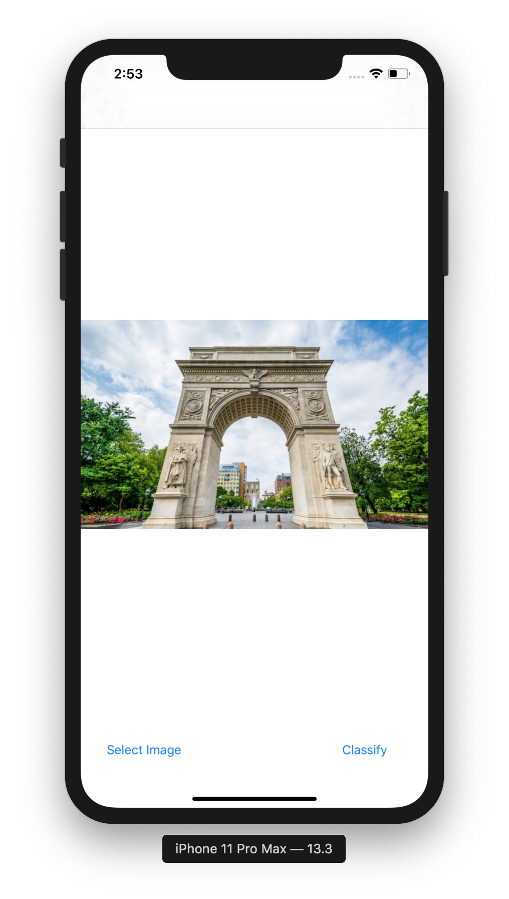
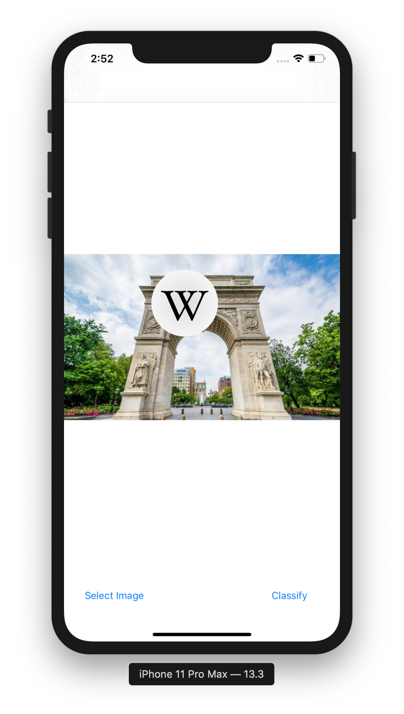
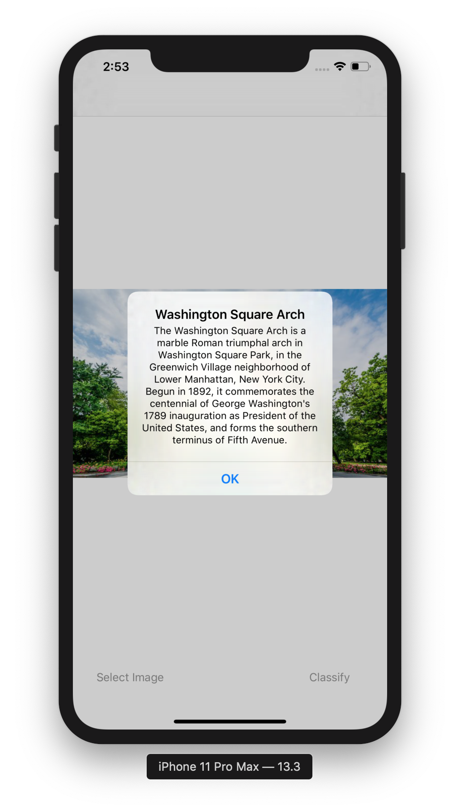

# Aurama - A mobile application for finding places of interest

This is the iOS implementation of the paper: Notable Site Recognition using Deep Learning on Mobile and Crowd-sourced Imagery

|Image|Localization|Wikipedia Description|
| :------: | :------: | :------: |
|||

## Usage:

###On macOS:
1. Install CocoaPods ([https://cocoapods.org](https://cocoapods.org)).
2. run `pod install` where `Podfile` is located.
3. open `Aurama.xcworkspace` to build and run Aurama.
4. Import images from in TestPhoto to iOS device to test model performance on different images.

###In the app:
5. Click `Select Image` to select image you want to classify.
6. Click `Classify` to find the location of the place on the image.
7. Click on the wiki logo for details about the location. If threre is no corresponding entry, the wiki logo will not showup.

## Credit:

1. Pytorch torch script implementation in iOS: [https://pytorch.org/mobile/ios/](https://pytorch.org/mobile/ios/)
2. Semantic Segmentation for Landmarks: [https://github.com/BlindAssist/blindassist-ios](https://github.com/BlindAssist/blindassist-ios)