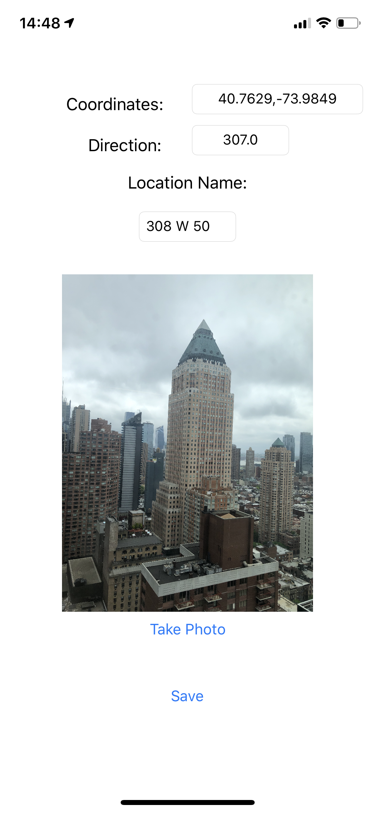

# Validation Image Capture App

This is the application we made to capture core information we need for testing mobile context. The extra information includes GPS information and device facing direction.

## Saving Data
We used CoreData to store relative information on the internal storage. GPS and direction are saved in CSV files that have name corresponds to each photo.

## Screenshot
Following is a sample screenshot on the device we used for taking samples. GPS and Direction are automatically detected. The Location Name is given by the user.

<figure>

<figcaption>Figure 1: Sample Capture Screenshot</figcaption>
</figure>

 

## Reference

The phototaking base for this app is IOSTakePhotoTutorial from [https://github.com/ioscreator/ioscreator](https://github.com/ioscreator/ioscreator)
